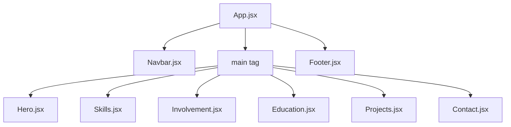

# Technical Design Document: Portfolio Website

This document provides a comprehensive overview of the design, architecture, component hierarchy, data structure, and technical implementation of the Portfolio Website.

---

## 1. Overview & Core Technologies

The portfolio is a performant, responsive, single-page application (SPA) designed to showcase projects, skills, education, and involvement. It is built using the following modern web technologies:

- **Core Framework**: React 18 (using Functional Components & Hooks)
- **Build Tool**: Vite (configured for fast HMR and optimized production bundles)
- **Styling Engine**: Tailwind CSS v3 (utility-first styling) with DaisyUI v4 (component-based semantic classes and theme management)
- **Animations**: Framer Motion v11 (for scroll-triggered reveals, transitions, and layout animations)
- **Icons**: Lucide React & React Icons (Si/Fa sets)
- **Automation Tools**: Puppeteer (for automated project screenshots)

---

## 2. Directory Structure

The codebase is organized into modular directories under the `src` folder:

```
portfolio/
├── public/                  # Static assets (favicons, PDFs, project screenshots)
├── src/
│   ├── assets/              # Static media assets used within components
│   ├── components/          # Global layout components (Navbar, Footer)
│   ├── data/                # Data files driving the UI contents
│   │   └── portfolioData.js # Centralized portfolio data and helper logic
│   ├── hooks/               # Custom React hooks (useTheme, useScrollSpy)
│   ├── sections/            # Component sections building up the landing page
│   │   ├── Contact.jsx
│   │   ├── Education.jsx
│   │   ├── Hero.jsx
│   │   ├── Involvement.jsx
│   │   ├── Projects.jsx
│   │   └── Skills.jsx
│   ├── App.css              # Boilerplate CSS (unused, see section 8)
│   ├── App.jsx              # Main App entry container
│   ├── index.css            # Tailwind directives and global base styles
│   └── main.jsx             # React DOM root render mount point
├── download_profile.js      # Script to download profile picture from link
├── screenshot.js            # Puppeteer script to screenshot live project sites
├── tailwind.config.js       # Tailwind configuration & custom theme palettes
└── vite.config.js           # Vite development and build settings
```

---

## 3. Data-Driven Architecture

The website uses a **decoupled data pattern** where all content (personal information, skills, experience, projects) is defined in a separate data file: `src/data/portfolioData.js`. This allows content updates to be made in a single place without modifying component markup.

### Core Data Models:
1. **`personalInfo`**: Standard contact, social links, availability, bio details, and CV file path.
2. **`navLinks`**: List of navigation anchors (`#home`, `#skills`, `#involvement`, `#education`, `#projects`, `#contact`).
3. **`skillsData`**: Array of skill categories, each containing individual skills with names and corresponding SVG icon component references.
4. **`involvementData`**: List of experience entries with roles, durations, organizations, and bullet points detailing accomplishments.
5. **`educationData`**: Academic timeline items containing degree names, institutions, and periods of attendance.
6. **`projectsData`**: Detailed list of project details (title, description, tech stack tags, live/source links, featured status, image paths, and status trackers like `in-progress`).

---

## 4. Layout & Section Components

The application is structured around a single page container (`App.jsx`) which mounts the global layout wrappers (`Navbar`, `Footer`) and the scrollable sections.



### Global Components:
- **`Navbar`**:
  - Anchors sticky navigation links.
  - Integrates the `useScrollSpy` hook to highlight the current section in the viewport with a spring-animated bottom indicator bar.
  - Houses the light/dark theme toggle, using the `useTheme` hook.
  - Contains a responsive slide-down menu for mobile screen sizes (using Framer Motion's `AnimatePresence`).
- **`Footer`**:
  - Renders a clean branding signature, a copyright statement, and hover-animated social links.

### Page Sections:
- **`Hero`**: The introductory landing screen. Incorporates dynamic fade-up animations. It features a profile image that scales slightly on hover, social links, a PDF resume shortcut, and a WhatsApp call-to-action button. It tracks image load states (`onLoad`) to prevent flash-of-unstyled-content (FOUC) by coordinating animations with image readiness.
- **`Skills`**: Displays categorization grids (Core Web, Frameworks, Styling, Tools, Learning). Hovering over individual skills triggers a scaling animation and highlights the icon color.
- **`Involvement` & `Education`**: Render chronological cards inside timelines. Both use horizontal/vertical configurations on smaller devices and are animated using scroll-triggered sliding transitions (`whileInView`).
- **`Projects`**: Renders custom cards that feature project preview screenshots, repository links, direct deployment links, and list bubbles for the technologies used. An animated pulsing "In Progress" badge is displayed over active developments.
- **`Contact`**: Incorporates a structured email draft generator. Upon submission, it sanitizes input and redirects the client to their default mail client using a prefilled `mailto:` string, ensuring a reliable contact pathway without requiring external backend endpoints.

---

## 5. Behavior Layer (Custom Hooks)

### A. Theme Engine (`useTheme.js`)
Handles switching between light and dark visual aesthetics. It communicates directly with DaisyUI and Tailwind CSS:
- **State Persistence**: Uses browser `localStorage` to retain theme choices across sessions.
- **CSS Variable Injection**: Binds theme changes to the `data-theme` attribute on the `<html>` root, triggering DaisyUI styles and variables automatically.

### B. Viewport Tracker (`useScrollSpy.js`)
Tracks which section of the page is currently in view:
- **Performance Optimization**: Rather than running heavy scroll event listeners on every frame, it utilizes `window.requestAnimationFrame` to throttle scroll position evaluations.
- **Active Identification**: Iterates backwards through navigation IDs, checking element offsets against the scroll position, applying styling to the active navbar link accordingly.

---

## 6. Theme and Styling System

Styling is handled globally via Tailwind CSS utility classes and semantic tokens provided by DaisyUI. Custom themes are configured in `tailwind.config.js` with exact hex colors designed to reflect a Figma workspace style:

### 1. `figmaDark` (Default Dark Mode)
- **Primary Color**: `#798156` (Olive green accent)
- **Background**: `#11140B` (Rich dark olive-black)
- **Secondary Background**: `#383B2B` / `#161910` (Dark card surfaces)
- **Text (Base Content)**: `#EDE9DE` (Soft warm cream)

### 2. `figmaLight` (Light Mode)
- **Primary Color**: `#5A633F` (Darker muted olive accent)
- **Background**: `#FAFAF6` (Soft warm cream canvas)
- **Secondary Background**: `#F1EFE6` / `#EAE7DA` (Muted cream card surfaces)
- **Text (Base Content)**: `#202514` (Deep olive charcoal for high contrast readability)

### Global Layout Styles (`index.css`):
- Includes a persistent background gradient using custom CSS custom variables (`--bg-grad-start` and `--bg-grad-end`) bound to the theme attribute.
- Configures smooth-scrolling behaviors globally.
- Enhances font smoothing (`-webkit-font-smoothing`) for cleaner typography rendering.

---

## 7. Supporting Automation Scripts

The project includes two Node-based utility scripts located in the root folder:

### A. Screenshot Generator (`screenshot.js`)
- Runs a headless instance of **Puppeteer** to navigate to project deployment URLs.
- Sets a standard viewport of 1440x900, waits 2 seconds for animations or images to settle, and captures screenshots, writing them directly into the `/public/projects/` directory.

### B. Profile Downloader (`download_profile.js`)
- Automates fetching the developer profile picture from an image-hosting link.
- Leverages regex patterns to parse open-graph metadata (`og:image`) and streams the image binary directly to `./public/profile.png`.

---

## 8. Redundancies and Recommendations

- **`src/App.css`**: This stylesheet contains boilerplate CSS classes from a generic template (such as `.counter`, `.hero`, `.ticks`, etc.). The component code is styled fully with Tailwind CSS/DaisyUI utilities and **does not import or use `App.css`**. It is recommended to delete this file to clean up the directory structure.
